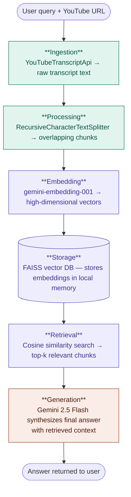

# YouTube Intelligence Bot (RAG-Powered)

This project utilises Retrieval-Augmented Generation (RAG) to summarise and query YouTube video content.

## Live Demo

## 🛠 Tech Stack
- **LLM**: Google Gemini 2.5 Flash
- **Embeddings**: gemini-embedding-001
- **Vector DB**: FAISS (Facebook AI Similarity Search)
- **Framework**: LangChain (LCEL)
- **UI**: Gradio

## Example Output
**Video**: "Life at 40"
**Summary**: *The speaker reflects on turning 41, emphasizing that aging is "badass" and a time for increased confidence, contrasting it with outdated stereotypes...*

## CI/CD Pipeline
This project uses **GitHub Actions** for automated testing and deployment:
1. **Linting**: Checks code quality via `flake8`.
2. **Auto-Deploy**: On every `push` to `main`, the application is automatically rebuilt and deployed to the cloud.

## How to Run Locally
1. Clone the repo: `git clone <repo-link>`
2. Install dependencies: `pip install -r requirements.txt`
3. Set Environment Variable: `export GOOGLE_API_KEY='your_key_here'`
4. Run: `python ytbot.py`

